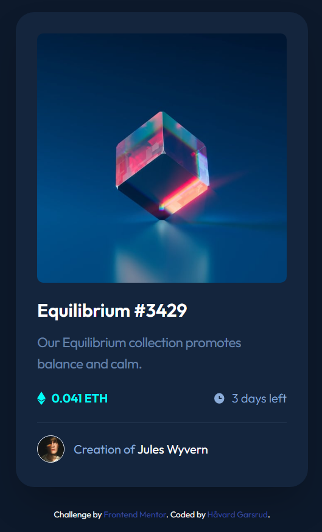

# Frontend Mentor - NFT preview card component solution

This is a solution to the [NFT preview card component challenge on Frontend Mentor](https://www.frontendmentor.io/challenges/nft-preview-card-component-SbdUL_w0U). Frontend Mentor challenges help you improve your coding skills by building realistic projects.

## Table of contents

- [Frontend Mentor - NFT preview card component solution](#frontend-mentor---nft-preview-card-component-solution)
  - [Table of contents](#table-of-contents)
  - [Overview](#overview)
    - [The challenge](#the-challenge)
    - [Screenshot](#screenshot)
    - [Links](#links)
  - [My process](#my-process)
    - [Built with](#built-with)
    - [What I learned](#what-i-learned)
  - [Author](#author)

## Overview

### The challenge

Users should be able to:

- View the optimal layout depending on their device's screen size
- See hover states for interactive elements

### Screenshot



### Links

- Live Site URL: [NFT Card Component with Tailwind CSS](https://haavga.github.io/NFT-card-component-with-Tailwind-CSS/)

## My process

### Built with

- Semantic HTML5 markup
- [Tailwind CSS](https://tailwindcss.com) for styling
- Flexbox
- Mobile-first workflow

### What I learned

Project went fine until I was going to add the hover state to the image. Figured out that I had to use the group-hover class to show the overlay when hovering over the image.

```html
<div class="group">
  <div
    class="bg-primary-100/50 invisible absolute left-7 top-7 flex h-[20.5rem] w-[20.5rem] items-center justify-center rounded-lg hover:cursor-pointer group-hover:visible"
  >
    
  </div>
  
</div>
```

## Author

- Frontend Mentor - [@HaavGa](https://www.frontendmentor.io/profile/HaavGa)
- LinkedIn - [Håvard Garsrud](https://www.linkedin.com/in/h%C3%A5vard-garsrud-27a095237/)
